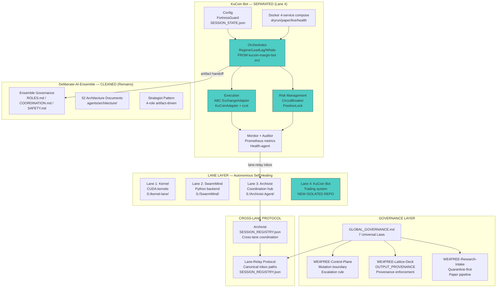
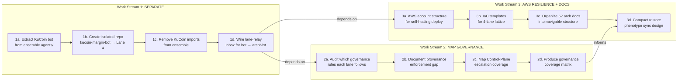
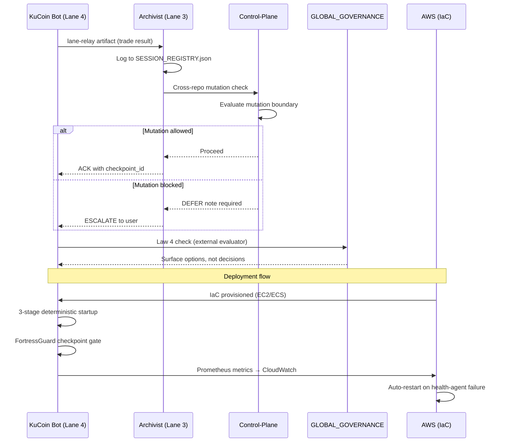

# KuCoin Margin Bot Separation & Multi-Governance Integration Architecture

**Created:** 2026-05-15
**Status:** Decisions resolved — execution in progress
**Traceability:** Journal-2026-05-15, memory bank entities: KuCoin-Margin-Bot-Project, Deliberate-AI-Ensemble

---

## 1. Current State: Mono Repo Overlap

The Deliberate-AI-Ensemble `agents/` directory contains Python files that **directly duplicate** kucoin-margin-bot components. The ensemble agents import `kucoin-python`, hardcode KuCoin API calls, and share identical class hierarchies.

```mermaid
graph TB
    subgraph "CURRENT: Deliberate-AI-Ensemble (Mono Repo)"
        direction TB
        DA[Deliberate-AI-Ensemble<br/>100+ top-level files/dirs]

        subgraph "agents/ — CODE OVERLAP"
            BA[base_agent.py<br/>AgentStatus enum<br/>BaseAgent class]
            ORC[orchestrator.py<br/>OrchestratorAgent<br/>WorkflowStage enum]
            EXE[executor.py<br/>ExecutionAgent<br/>KuCoin API client<br/>_place_live_order]
            RM[risk_manager.py<br/>RiskManagementAgent<br/>Position sizing<br/>Asset-specific configs]
            BT[backtester.py]
            MA[market_analyzer.py]
            DF[data_fetcher.py]
            MO[monitor.py]
            AU[auditor.py]
        end

        subgraph "agents/architecture/ — 52 DOCS"
            A00[00_SKELETON.md]
            A01[01_SYSTEM_OVERVIEW.md]
            A04[04_SAFETY_ARCHITECTURE.md]
            A50[...through 50_SYSTEM_GUARANTEES.md]
        end

        subgraph "agents/ — ENSEMBLE GOVERNANCE"
            ROLES[ROLES.md<br/>4-role pattern<br/>Strategist/Engineer/Validator/Archivist]
            COORD[COORDINATION.md<br/>10 coordination states<br/>Artifact-driven handoffs]
            SAFETY[SAFETY.md<br/>4 escalation levels<br/>Constitutional validator]
        end

        DA --> BA
        DA --> ORC
        DA --> EXE
        DA --> RM
        ORC --> BA
        EXE --> BA
        RM --> BA
        EXE -->|imports kucoin-python| KUAPI[KuCoin API]
    end

    subgraph "CURRENT: kucoin-margin-bot (GitHub Private)"
        direction TB
        KB[kucoin-margin-bot<br/>vortsghost2025/kucoin-margin-bot]

        subgraph "src/ — PRODUCTION CODE"
            KORC[src/orchestrator/<br/>Regime/LeadLag/Whale]
            KEXE[src/execution/<br/>ABC ExchangeAdapter<br/>KuCoinAdapter]
            KRM[src/risk/<br/>CircuitBreaker<br/>PositionLock]
            KCFG[src/config/<br/>SESSION_STATE.json<br/>FortressGuard]
        end

        subgraph "Deployment"
            KDOCK[Dockerfile multi-stage<br/>Python 3.11-slim]
            KCOMP[docker-compose.yml<br/>4 services: dryrun/paper/live/health]
            KCI[CI workflows<br/>backtest/docker-verify/quality/test]
        end

        KB --> KORC
        KB --> KEXE
        KB --> KRM
        KB --> KDOCK
        KB --> KCOMP
    end

    style EXE fill:#ff6b6b,stroke:#333
    style ORC fill:#ff6b6b,stroke:#333
    style RM fill:#ff6b6b,stroke:#333
    style BA fill:#ffa500,stroke:#333
```



### Overlap Matrix

| Ensemble Agent | kucoin-margin-bot Equivalent | Overlap Level |
|---|---|---|
| `orchestrator.py` → `OrchestratorAgent` | `src/orchestrator/` (Regime/LeadLag/Whale) | **HIGH** — same pattern, ensemble is simplified |
| `executor.py` → `ExecutionAgent` | `src/execution/` (ABC ExchangeAdapter) | **CRITICAL** — direct `kucoin-python` import, live order placement |
| `risk_manager.py` → `RiskManagementAgent` | `src/risk/` (CircuitBreaker, PositionLock) | **HIGH** — same logic, ensemble lacks circuit breaker |
| `base_agent.py` → `BaseAgent` | No direct equivalent | **MEDIUM** — shared class hierarchy |
| `backtester.py` | `src/backtest/` | **MEDIUM** — similar interface |
| `market_analyzer.py` | `src/analysis/` | **MEDIUM** — similar interface |
| `data_fetcher.py` | `src/data/` | **LOW** — data source abstraction differs |
| `monitor.py` / `auditor.py` | `src/monitoring/` | **LOW** — ensemble has richer governance docs |

---

## 2. Target State: Separated Bot + Multi-Governance Lattice



---

## 3. Three Work Streams



---

## 4. Data Flow: Bot ↔ Governance ↔ AWS



---

## 5. Failure Mode Coverage (Paper F)

| NFM | Failure Mode | Current Mitigation | Gap | Work Stream |
|---|---|---|---|---|
| NFM-002 | Self-state aliasing | FortressGuard SESSION_STATE.json | Ensemble has no equivalent | WS1 |
| NFM-020 | Cross-lane observability boundary | Lane-relay canonical paths | Provenance is honor-system only (Lattice-Deck gap) | WS2 |
| NFM-029 | Subagent contract violation | BaseAgent idempotency contract | No runtime enforcement | WS2 |
| NFM-030 | Subagent trust escalation | Safety.md 4 escalation levels | No automated escalation to AWS | WS3 |
| NFM-033 | Subagent state drift | Checkpoint/recovery protocol | No compact restore phenotype sync | WS3 |

---

## 6. Key Decisions — RESOLVED

1. **Repo location for separated bot:** ✅ Both — local `S:\kucoin-lane\` + GitHub repo under `vortsghost2025/`
2. **Ensemble agents/ fate:** ✅ Delete duplicated Python files after extraction; ensemble becomes governance-only
3. **AWS region + service selection:** ⏳ Decided later — focus on code extraction first
4. **Provenance enforcement:** ✅ Document and defer — record gap in governance coverage matrix, fix later
5. **52 architecture docs:** ✅ Navigation index — create TOC with tags, keep all 52 files

---

## 7. Recommended Execution Order

```
WS1a → WS2a → WS2b → WS1b → WS1c → WS2c → WS2d → WS1d → WS3a → WS3b → WS3c → WS3d
```

Rationale: Map governance (WS2a/2b) before extracting code (WS1b/1c) so the mutation boundary is clear. Complete governance coverage matrix (WS2d) before wiring lane-relay (WS1d). AWS provisioning (WS3a/3b) and doc organization (WS3c/3d) can run in parallel with WS1d.

---

*Co-Authored-By: Kilo <noreply@kilo.ai>*
